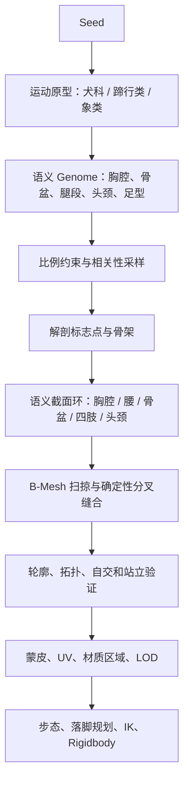

# 程序化生物 V5：解剖约束 PCG 方案

## 1. 结论

当前 V4 适合生成“连续、无裂缝的外星软体”，不适合直接生成“像真实四足动物的身体”。问题不是随机范围还不够精细，而是生成表示本身缺少解剖结构。

推荐把 V5 定义为：

> **基于解剖原型的参数化形态生成（anatomy-constrained parametric PCG） + 形态驱动的程序化运动。**

最重要的变化是：不再让随机数直接决定一堆椭球和胶囊的尺寸，而是先选择一种有完整拓扑和骨骼语义的运动原型，再在生物学约束内生成个体差异。

本方案有一条硬约束：**不使用 Blender，不导入任何手工身体网格、Morph Target 或动画片段。** 原型只是一组 C# 数据和拓扑规则；所有顶点、三角形、UV、蒙皮权重、骨架和动作都由 Unity 运行时生成。



## 2. 当前 V4 为什么会生成得丑

### 2.1 随机参数没有表达“动物类别”

当前生成器在 `ProceduralCreatureGenerator.cs` 中分别随机身体长、宽、高、腿长、颈长、头部尺寸和足部尺寸。虽然之后有 Clamp，但这些变量多数仍是独立采样。

真实动物的比例不是独立的。例如：

- 腿越长，远端肢体通常越细，足部质量也会更小。
- 胸腔深度会影响肩关节位置、腿根间距和身体离地高度。
- 头颈变长时，肩带、前肢负重和重心位置也要随之改变。
- 象类的柱状腿、犬科的趾行足和鹿科的蹄行足不能共享同一组脚踝半径。

如果先随机每个尺寸，再逐项 Clamp，只能保证数值不越界，不能保证这些尺寸组合成一个合理物种。

### 2.2 身体是“平滑图元并集”，不是解剖表面

当前 `CreaturePhenotype.SampleDistance()` 把以下图元做 Smooth Minimum：

- 躯干样条截面。
- 头和口鼻椭球。
- 上腿、下腿、远端腿胶囊。
- 脚部椭球和关节连接体。

然后 `CreatureImplicitBodyMesher` 使用 Marching Tetrahedra 从距离场抽取三角面。

这个方法的优点很明确：

- 不容易出现开放边界。
- 肢体与躯干可以自动融合。
- 修改长度、半径后仍可重新生成。

但它天然会丢失动物外形中最重要的结构：

- 肩胛、胸腔、腰和骨盆之间的体块转折。
- 肌肉沿骨骼方向形成的非圆形截面。
- 腕、跗和蹄的硬边界及特定拓扑。
- 眼眶、额头、鼻梁、下颌等头部平面。
- 毛流、皮肤褶皱和局部材质区域。

Smooth Union 会主动抹平转折。因此提高网格分辨率只能让肉团更光滑，不能让它更像动物。

### 2.3 同一网格算法承担了互相冲突的目标

当前方案同时想做到：

1. 任意比例都能闭合。
2. 肢体连接没有裂缝。
3. 具有真实动物的清晰解剖轮廓。
4. 自动得到适合动画的拓扑。

距离场很擅长前两项，但不擅长后两项。Marching Tetrahedra 产生的三角形沿采样网格分布，不会自动形成肩、膝、眼眶周围适合变形的环线。即使蒙皮权重正确，关节弯曲时轮廓仍会像橡胶管。

### 2.4 材质随机数放大了“不像动物”的感觉

当前颜色来自 HSV 大范围随机，网格颜色再在主色和辅色之间插值。缺少以下语义区域：

- 背部、腹部和四肢末端的颜色规律。
- 眼、鼻、蹄、爪、角等角质区域。
- 粗糙度、法线细节和毛流方向。
- 物种级花纹规则。

所以即使几何勉强可读，均匀的光滑高光也会把它表现成蜡或塑料。

## 3. 三种改造路线比较

| 路线 | 做法 | 优点 | 缺点 | 结论 |
|---|---|---|---|---|
| 继续 V4 SDF | 增加更多胶囊、椭球和局部半径规则 | 改动小、闭合稳定 | 参数越来越多，仍缺解剖拓扑 | 只保留作预览、碰撞或外星软体 |
| 通用数学曲面 | 用互不相关的参数曲面构造身体后再拼接 | 完全运行时生成 | 接口、UV 和动画拓扑难以统一 | 不作为主线 |
| 语义 B-Mesh | 从骨架和解剖截面环扫掠出规则网格，在插槽处确定性缝合 | 完全程序化、边环和蒙皮可控 | 需要实现分叉拓扑、截面坐标系和自交修复 | **无 Blender 条件下的推荐路线** |

V5 固定的不是模型，而是“拓扑语法”：每类节点需要几圈顶点、截面如何变化、分叉如何连接、哪些边属于关节环。由种子决定的仍然包括身体比例、局部轮廓、骨架、花纹、颜色、角和耳朵、质量参数、步态及动作。

## 4. V5 的核心数据模型

### 4.1 代码化原型规则

每种运动策略对应一份纯数据 `CreatureAnatomyProfile`。它可以序列化为 ScriptableObject 方便检查，也可以由 C# 静态表创建，但其中不保存 Mesh：

```csharp
public enum CreatureAnatomyFamily
{
    CursorialCanid,       // 狼、犬：趾行，远端轻，脊柱参与奔跑
    CursorialUngulate,    // 鹿、羚羊、马：蹄行，长掌骨/跖骨，小蹄
    GraviportalElephant   // 象：柱状肢体，大脚垫，无典型腾空奔跑
}

public sealed class CreatureAnatomyProfile
{
    public CreatureAnatomyFamily family;
    public CreatureSectionProfile[] torsoSections;
    public CreatureSectionProfile[] neckSections;
    public CreatureSectionProfile[] headSections;
    public CreatureLimbTopologyProfile frontLeg;
    public CreatureLimbTopologyProfile rearLeg;
    public CreatureFootTopologyProfile foot;
    public CreatureJunctionRule[] junctionRules;
    public CreatureParameterDistribution distributions;
}
```

代码生成的网格必须具备：

- 同一原型和 LOD 下可预测的顶点、边和三角形索引。
- 肩、肘、腕、髋、膝、跗周围的变形环线。
- 扫掠时同步生成的 UV 和材质区域 ID。
- 胸腔、腰、骨盆、颈根、头部和四足的语义标志点。
- 已验证的静止姿势和关节弯曲方向。

### 4.2 语义 Genome

Genome 不再保存“随机出来的所有尺寸”，而保存有限、可解释的基因：

```csharp
public readonly struct CreatureMorphGenomeV5
{
    public readonly int seed;
    public readonly CreatureAnatomyFamily family;

    public readonly float overallScale;
    public readonly float thoraxLength;
    public readonly float thoraxDepth;
    public readonly float waistTuck;
    public readonly float pelvisWidth;
    public readonly float shoulderHeight;

    public readonly float proximalLimbLength;
    public readonly float distalLimbLength;
    public readonly float distalSlenderness;
    public readonly float footLength;

    public readonly float neckLength;
    public readonly float neckAngle;
    public readonly float muzzleLength;
    public readonly float earScale;
}
```

这些基因不能独立均匀采样。推荐使用“条件分布 + 相关矩阵”：

```text
先采样 family
  -> 根据 family 选择均值、方差和允许范围
  -> 采样一个低维 latent vector
  -> 通过相关矩阵得到互相关联的形态参数
  -> 运行硬约束修复
  -> 不可修复则重新采样
```

例如蹄行类中，`distalLimbLength` 增大时，应自动提高 `distalSlenderness`、减小 `footMass`，并限制躯干宽度。这样随机结果仍有差异，但不会把鹿的长腿和象脚随机组合在一起。

## 5. 推荐的网格生成算法

### 5.1 第一级：生成骨架和无扭转局部坐标系

先根据 Genome 生成骨架位置。沿每条骨链使用 Parallel Transport Frame 建立连续坐标系，避免用 `Quaternion.LookRotation` 独立计算每一圈造成截面突然翻转。

### 5.2 第二级：沿骨链生成语义截面环

每个截面不是固定圆形，而是带语义的超椭圆或径向函数：

```text
P(s, theta) = Center(s)
            + FrameRight(s) * RadiusX(s, theta)
            + FrameUp(s)    * RadiusY(s, theta)
```

`RadiusX/RadiusY` 由截面类型决定：胸腔深而宽，腰部收窄，骨盆后上方更饱满；大腿截面可前后不对称，远端腿接近细椭圆。每圈使用固定的 8、12 或 16 个顶点，LOD 只改变圈数和环数。

### 5.3 第三级：确定性分叉缝合

腿根、颈根和尾根不能通过布尔运算临时粘接。生成躯干时先按照插槽位置预留固定顶点数的椭圆孔，再生成 1 到 3 圈过渡环，将孔环与肢体首环一一连接：

```text
躯干插槽环 12 点
    -> 过渡环 12 点
    -> 肩部肌肉环 12 点
    -> 上肢首环 12 点
```

插槽之间必须满足最小网格距离。空间不足时缩小插槽或拒绝该 Genome，而不是允许两个分叉拓扑重叠。

### 5.4 第四级：关节环、末端和蒙皮

关节处增加压缩侧和拉伸侧需要的边环，但外表不生成球形“关节包”。足部使用独立的代码化拓扑生成器：蹄由上口环、蹄冠环、接地轮廓和底面构成；犬足使用掌垫与趾的分支规则；象足使用柱状末端和宽接地垫。

顶点在生成时就知道所属骨段和轴向参数，因此蒙皮权重直接写入：一圈中部通常由单骨控制，关节过渡圈才在父子骨之间插值。这比根据空间距离猜测权重稳定。

### 5.5 第五级：细分与有限平滑

基础网格完成后可执行一次 Catmull-Clark 或保边界的细分，再进行 1 到 2 次带体积约束的 Laplacian/Taubin 平滑。膝、腕、蹄冠、下颌等语义边具有 crease 权重，不能被整体磨圆。

### 5.6 SDF 的新角色

V5 不需要完全删除现有 SDF。它适合继续用于：

- 编辑模式中的快速低质量预览。
- 根据身体轮廓生成近似碰撞体。
- 角、甲片和软组织突起与身体的局部融合蒙版。
- 外星软体、肿瘤状附着物等本来就需要圆滑融合的结构。

但最终可见的主体网格不再由 Marching Tetrahedra 生成。

## 6. 身体各区域的生成规则

### 6.1 躯干

躯干至少分为四个语义体块：肩带、胸腔、腰、骨盆。它们共享连续表面，但不能共享一个均匀椭圆截面。

- 肩带决定前腿插槽与前胸宽度。
- 胸腔是身体最深区域。
- 腰部应收窄，不能和胸腔同粗。
- 骨盆为后腿提供独立体块，臀部轮廓不能只靠一根腿胶囊融合。

### 6.2 四肢

近端肢体的一部分必须隐藏在肩带或骨盆体块内。可见表面应按照肌肉轮廓生成，而不是直接显示整根骨骼胶囊。

- 犬科：上臂和大腿较有肌肉，腕/跷部细，足为趾行爪足。
- 蹄行类：肌肉集中在近端，远端长而轻，脚为小型蹄。
- 象类：肢体接近柱状，关节外形不突出，脚底为宽垫。

前后足属于同一个足型家族，但允许前足略宽、后足略窄；不能生成完全不同的结构。

### 6.3 头颈

头部需要显式语义截面链：颅后、颅腔、额头、眼眶、鼻梁、口鼻和下颌。每段使用不同超椭圆截面和 crease 边，不能只使用一个头椭球加一个口鼻椭球。

颈部应从肩带宽截面逐渐过渡到颅底窄截面，并允许颈椎形成弧线。蹄行类通常需要明显的颈根、喉部和头颈夹角。

### 6.4 材质与花纹

材质生成应分成三层：

1. **物种基础材质**：毛、皮、鳞或甲片，决定粗糙度和法线尺度。
2. **解剖区域**：背、腹、口鼻、眼周、肢端、蹄/爪、角。
3. **个体花纹**：斑点、条纹、渐变和伤痕。

颜色推荐从自然色板中分层采样，不再对整个 HSV 空间均匀随机。蹄、鼻和眼必须使用独立材质区域，避免整个动物具有同样的蜡质高光。

## 7. 运动系统如何与 V5 连接

现有 `CreatureProceduralController` 的命令、落脚规划和三段腿概念可以保留，但输入数据改为 V5 标志点：

```text
Genome V5
  -> 形变后的髋/肩、膝/肘、跗/腕、足底标志点
  -> 真实骨长和关节限制
  -> 计算步幅、步频、抬脚高度、身体离地高度
  -> CPG 相位
  -> 世界空间落脚点
  -> 三段腿 IK
  -> Rigidbody 受力
```

这会形成真正的“形态与动作闭环”：长腿动物自然具有更长步幅；象类不会进入腾空跑；蹄行类使用小支撑面和更直立的远端肢体；犬科在高速时可以增加脊柱屈伸。

## 8. 质量门槛

V5 的“合法”不能只检查无 NaN 和网格闭合，还要检查可见质量。

### 自动几何检查

- 三角形无翻转、无自交、无零面积。
- 关节区域边长和权重连续。
- 左右肢体间距大于最小值。
- 静止姿势下足底均能到达地面。
- 重心投影位于四足支撑区域内。
- 腿段比例落在原型允许区间。

### 轮廓检查

为每个种子渲染固定的侧视、正视、后视和俯视图，提取二值轮廓并检查：

- 胸腔、腰、骨盆的宽深比。
- 四足是否位于肩和髋下方。
- 腹部与地面的间隙。
- 头颈相对躯干的比例。
- 左右轮廓是否出现穿插或异常尖角。

### 参考样本

每种原型先制作 5 到 10 个“金标准”种子。随机生成器每次改动后自动输出接触表，对比轮廓和关键比例。视觉回归不能完全由数值测试替代。

## 9. 实施顺序

### 阶段 1：只做好一个鹿科/羚羊型原型

1. 在 Unity 中实现 `SectionRing`、Parallel Transport Frame 和环间 Quad Bridge。
2. 用截面环生成肩、胸、腰、骨盆连续躯干，不读取任何外部 Mesh。
3. 实现腿根椭圆孔、过渡环和固定点数 Junction 缝合。
4. 实现三段蹄行腿以及代码化蹄拓扑。
5. 自动生成 UV、材质区域、骨权重和 LOD。
6. 接入现有程序化步态和三段腿 IK，并用种子 `222` 做第一份视觉基准。

### 阶段 2：材质和个体变化

1. 增加毛皮、口鼻、眼和蹄的材质区域。
2. 实现自然色板及鹿科斑点/背腹渐变。
3. 加入耳、角和尾部模块，但接口位置由标志点控制。

### 阶段 3：增加犬科与象类

每个新原型拥有独立截面规则、Junction 规则、比例分布、足型、关节限制和步态参数。不能只把腿粗细切换一下就声称变成另一类动物。

### 阶段 4：编辑器和缓存

- `E` 编辑只暴露语义基因。
- 形变网格按 `version + family + genomeHash + LOD` 缓存。
- 事务式替换网格、骨架、碰撞体和动作参数。
- 远距离使用更少的截面环和截面顶点，生成确定性的低分辨率拓扑。

## 10. 对当前 V4 的处理建议

不删除 V4。将它重新定位为：

- 运行时隐式表面研究路线。
- 外星软体或非真实生物生成器。
- V5 的碰撞体和编辑预览辅助工具。
- 三段腿 IK、Rigidbody 控制和遥测系统的验证场景。

当前已把四足分为犬科、蹄行类和象类，并修复了蹄行类仍使用固定大脚踝半径的问题。这能缓解局部异常，但多角度场景截图仍表明 V4 无法靠半径调参达到真实动物质量，因此不应继续在同一表示上无限增加特殊分支。

## 11. 答辩表述

可以这样概括技术选择：

> V4 使用隐式距离场和 Marching Tetrahedra，优点是运行时生成和无缝融合，但生成拓扑缺乏解剖语义，容易得到光滑却不可信的形体。V5 不使用 Blender 或预制网格，而是在 Unity 中根据解剖骨架、语义截面和分叉规则生成 Quad-Dominant 蒙皮；相关形态基因控制截面、骨架比例、材质花纹和动作参数。最终动作仍由 CPG、落脚规划、IK 和物理控制生成，因此身体生成与动作生成共享同一个 Phenotype 数据源。

这个方案的关键不是减少程序化程度，而是把随机性放在“合理变化空间”内。

## 12. 生物力学参考

- 犬类前肢主要承担制动、后肢主要承担推进，可参考：[Fore-aft ground force adaptations to induced forelimb lameness in walking and trotting dogs](https://pmc.ncbi.nlm.nih.gov/articles/PMC3530583/)。
- 犬类站立时前肢通常承担更多体重，可参考：[A review of kinetic and kinematic gait analysis in dogs and cats](https://pmc.ncbi.nlm.nih.gov/articles/PMC4204836/)。
- 象的前肢承担接近三分之二体重，快速移动仍没有典型腾空步态，可参考：[Biomechanics of locomotion in Asian elephants](https://journals.biologists.com/jeb/article/213/5/694/10070/Biomechanics-of-locomotion-in-Asian-elephants)。
- 象在提速时后肢关节弯曲模式会连续变化，可参考：[The movements of limb segments and joints during locomotion in African and Asian elephants](https://journals.biologists.com/jeb/article/211/17/2735/17733/The-movements-of-limb-segments-and-joints-during)。
- 奔跑型哺乳动物把肌肉质量集中在近端、使用较轻的远端肢体以降低摆动惯量，可参考：[Biomechanics and energetics of walking and running in horses](https://pubmed.ncbi.nlm.nih.gov/27898852/)。
