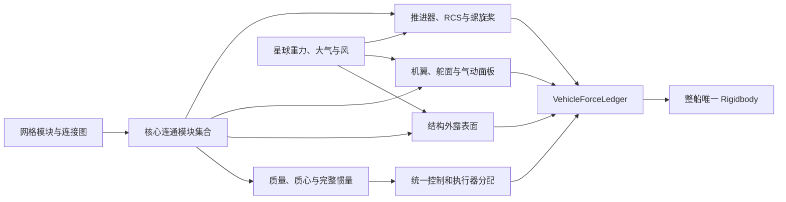

# Vehicle Physics RC3.3：当前飞船物理模型说明

## 1. 系统定位

当前飞船采用一套“单刚体载具、模块级物理贡献、可玩性优先辅助”的 RC3.3 飞行模型。

它不是微软飞行模拟器级别的完整飞行模拟，但遵守以下原则：

- 力和力矩必须有明确物理来源。
- 模块的质量、位置、方向和数量会连续改变载具性能。
- 辅助系统只改善可控性，不在标准模式凭空提供升力或转矩。
- 不合理设计会更慢、更难转、更容易失速，严重缺少能力时才无法飞行。
- 战损后只使用剩余且与核心连通的模块重新计算物理状态。

## 2. 总体计算链路



每个固定物理步按照以下顺序执行：

1. 应用结构变化并移除断连模块。
2. 必要时重建质量、质心、惯量、气动面和执行器。
3. 采样当前星球的重力、大气密度、风和阵风。
4. 计算外露结构阻力、机翼气动力、尾流和螺旋桨洗流。
5. 读取玩家输入并应用当前辅助模式。
6. 统一分配推进器、RCS和舵面。
7. 汇总所有模块产生的力和 `r × F` 力矩。
8. 向主 Rigidbody 提交一次总力和一次总力矩。
9. 使用执行器实际输出更新尾焰、动画、声音和遥测。

## 3. 结构与连接模型

- 整艘飞船使用一个主 Rigidbody。
- 每个模块是结构图中的一个节点。
- 模块之间的六面接触关系形成无向连接边。
- 多格模块仍然只作为一个节点。
- 只有能从核心遍历到的模块参与物理和功能计算。
- 视觉模型、皮肤和粒子偏移不改变网格物理数据。
- 物理尺寸主要来自模块占格和人工物理配置。

断连模块不会继续提供：

- 质量和惯量
- 推力与姿态控制
- 机翼升力与舵面控制
- 结构空气阻力
- 武器与能源
- 载具碰撞和伤害接收

## 4. 质量、质心和完整惯量

每个核心连通模块独立贡献：

- 模块质量
- 模块局部质心
- 占格盒局部惯量
- 模块相对整船质心产生的平行轴惯量

系统使用双精度累加完整对称 `3×3` 惯量矩阵，并计算主惯量和主轴旋转。

主要结果：

- 总质量决定线加速度。
- 质心位置决定整体平衡和执行器力臂。
- 惯量决定俯仰、偏航和滚转的难易程度。
- 紧凑载具通常旋转更快。
- 长轴或宽体载具通常更稳定，但旋转更迟钝。
- 外侧重型模块会显著增加对应旋转轴的惯量。
- 不对称质量分布会改变主惯量轴。

正常载具的主惯量还需要满足三角不等式：

```text
Ix <= Iy + Iz
Iy <= Ix + Iz
Iz <= Ix + Iy
```

## 5. 推进器与 RCS

每个实体推进器只有一个共享油门：

```text
0 <= throttle <= 1
```

推进器必须同时产生配对的力和力矩：

```text
Force  = throttle × maximumForce × direction
Torque = (thrusterPosition - centerOfMass) × Force
```

当前主要参数：

| 模块 | 最大推力 | 响应时间 | 环境特性 |
|---|---:|---:|---|
| `rocket_222` | 120000 N | 0.12 s | 火箭推进器，可在真空工作 |
| `speed_rocketsmall_112` | 3000 N | 0.05 s | 快速 RCS 和姿态控制 |
| `small_propeller_224` | 7500 N | 0.20 s | 仅在有大气环境中有效 |

推进器位置具有实际意义：

- 靠近质心安装更适合纯平移。
- 远离质心安装可以提供更大的旋转力臂。
- 对称布局可以减少平移时的附带力矩。
- 不对称布局需要占用其他执行器进行配平。
- 推进器方向错误会造成对应控制轴缺失。

24向系统用于描述方向能力和分配油门，但最终输出必须落实到实体推进器，不能独立生成物理上不存在的力或力矩。

## 6. 星球环境

星球环境统一提供：

- 重力加速度
- 当前高度
- 空气密度
- 环境气压
- 平均风
- 低频阵风
- 地表距离与地表法线

所有气动力使用模块所在位置的相对空气速度：

```text
Vair(point) =
    Rigidbody.GetPointVelocity(point)
    - AtmosphereVelocity(point)
    - PropellerWashVelocity(point)
```

因此：

- 飞船旋转时，外侧模块具有不同的局部气流速度。
- 玩家与环境同向飞行时，相对气流会降低。
- 逆风飞行时动态压强会提高。
- 无大气星球没有风、机翼升力和螺旋桨推力。

## 7. 结构空气阻力

系统根据网格占用关系生成模块外露表面：

- 模块之间互相接触的内部面不产生空气阻力。
- 只有迎风的外露面参与阻力计算。
- 结构和装甲基础阻力系数为 `Cd = 0.7`。
- 外露武器和功能模块基础阻力系数为 `Cd = 0.9`。
- 机翼使用独立气动模型，不重复进入结构阻力。

单个外露面的阻力近似为：

```text
D = 0.5 × airDensity × Cd × area × velocity × |velocity|
```

这意味着：

- 增加外露装甲会降低加速度和终端速度。
- 流线型布局比大面积迎风布局效率更高。
- 旋转中的外侧结构会自然产生空气阻尼。

## 8. 机翼与舵面

只有经过人工物理配置的机翼和舵面才会产生升力及控制力。未配置模块仅作为结构阻力体。

每块机翼最多划分为4个约1米翼展的气动面板，全船最多256个面板。

每个面板独立计算：

- 局部点速度
- 风和阵风
- 螺旋桨洗流
- 迎角
- 侧滑角
- 动态压强
- 升力
- 零升阻力
- 诱导阻力
- 气动力作用位置产生的力矩

有限翼升力斜率会考虑：

- 展弦比
- 奥斯瓦尔德效率
- 后掠角
- 安装角
- 表面法线与翼展方向

气动力作用在模块气动中心，并通过真实的 `r × F` 影响整船。

### 舵面

舵面不是直接添加独立转矩，而是通过偏转改变局部有效迎角。

当前规则：

- `rudder_wing_223` 最大偏转约20°，偏转速度约90°/s。
- `waste_rudder` 最大偏转约20°，偏转速度约120°/s。
- 舵面能力随动态压强变化。
- 低速时舵面控制力自然下降。
- 铰链负载过高会限制实际偏转。

## 9. 动态失速

失速使用连续气流分离状态，而不是单帧开关：

- 18°迎角开始分离。
- 35°迎角进入深度失速。
- 气流分离时间常数约0.18秒。
- 重新附着时间常数约0.55秒。
- 降低迎角后可以逐渐恢复。

附着状态使用有限翼升阻力模型。深度失速平滑过渡到平板模型：

```text
CL = sin(2 × angleOfAttack)
CD = 0.15 + 1.75 × sin²(angleOfAttack)
```

系统不会：

- 瞬间将升力归零
- 随机制造翻滚力矩
- 随机改变输入
- 瞬间把飞船扶正

## 10. 机身遮挡、尾流和下洗

每个气动面板使用5条占格射线估算机身遮挡：

- 完全无遮挡时保持100%动态压强。
- 严重遮挡时最低保留约25%的混合气流。
- 遮挡变化连续，不会让机翼突然完全失效。

机翼之间使用单向的上游到下游气动交互图：

- 上游机翼会影响下游机翼。
- 尾流半径随翼展和下游距离扩大。
- 下洗角最大限制在约12°。
- 不建立循环反馈，避免数值振荡。

## 11. 螺旋桨洗流

螺旋桨会改变其后方机翼和舵面的局部空气速度：

- 低速时可以提高洗流范围内舵面的控制能力。
- 洗流随距离和扩张截面积逐渐衰减。
- 机身遮挡会降低螺旋桨推力和洗流效果。
- 无大气时螺旋桨和洗流均失效。
- 洗流只修改局部气流，不直接添加隐藏升力。

## 12. 机翼地面效应

地面效应只作用于真实机翼：

- 接近地面时最多提高约8%的升力。
- 接近地面时最多降低约55%的诱导阻力。
- 效果根据机翼与地表距离连续变化。
- 不作用于火箭推进器、RCS或核心能力。

## 13. 三种辅助模式

三个模式共用完全相同的质量、惯量、推进器和气动底层。

| 模式 | 输入保护 | 自动配平 | 核心虚拟能力 |
|---|---|---|---|
| 标准 | 软飞行包线 | 最多使用35%真实控制权 | 无 |
| 新手 | 更强恢复保护 | 最多使用60%真实控制权 | 真实能力不足时允许 |
| 无辅助 | 无 | 无 | 无 |

### 标准模式

- 不提供隐藏升力。
- 不提供隐藏姿态转矩。
- 配平会占用真实推进器、RCS和舵面能力。
- 接近失速时，只削弱继续加深失速的输入。
- 能够降低迎角、侧滑或气流分离的恢复输入保持100%。

输入整形大致规则：

- 气流分离低于10%：保持完整输入。
- 气流分离接近50%：危险方向输入平滑降至约35%。
- 深度失速：危险方向最低保留约15%。

### 新手模式

- 具有更强的恢复保护。
- 真实执行器优先。
- 只有真实能力不足时才允许核心能力参与。
- 核心贡献必须与实体推进器贡献分开统计。

### 无辅助模式

- 不自动配平。
- 不自动阻尼。
- 不使用软飞行包线。
- 不提供核心虚拟能力。
- 所有姿态变化完全由真实模块和气动力决定。

## 14. 输入语义

| 输入 | 行为 |
|---|---|
| `W/S` | 相机平面前后移动 |
| `A/D` | 相机平面左右移动 |
| `Space/Ctrl` | 世界坐标上升/下降 |
| 鼠标 | 目标俯仰和偏航 |
| `Q/E` | 左右翻滚 |
| `Shift` | 请求更高推力 |
| `X` | 悬停和制动请求 |

WASD和Space/Ctrl只表达平移意图，不直接生成飞船倾斜目标。鼠标和Q/E负责姿态意图。

## 15. 改装如何影响驾驶手感

### 增加推进器

- 提高对应方向加速度。
- 通常提高终端速度。
- 同时增加质量。
- 不合理位置可能增加附带力矩和配平占用。

### 增加机翼

- 降低失速速度。
- 提高高速升力。
- 增加结构质量、阻力和惯量。
- 安装位置会改变俯仰和滚转稳定性。

### 增加舵面或RCS

- 提高姿态控制能力。
- 远离质心通常具有更大力臂。
- 过度外置会增加惯量和空气阻力。

### 增加装甲

- 提高生存能力。
- 降低线加速度。
- 增加制动距离。
- 增加惯量和迎风面积。

### 不对称布局

- 改变质心和主惯量轴。
- 增加真实配平占用。
- 可能产生可预测的残余偏航或滚转。
- 不会由系统随机制造持续旋转。

## 16. 战损后的物理重建

模块被摧毁或失去核心连接后，系统会在下一个物理步统一重建：

- 剩余质量
- 新质心
- 完整惯量和主轴
- 外露结构表面
- 机翼和舵面
- 推进器控制矩阵
- 六向推力能力
- 稳定性和配平占用

战损产生的连续影响包括：

- 单侧机翼脱落：升力下降并改变滚转稳定性。
- 推进器脱落：对应方向推力和控制能力下降。
- 重型外侧模块脱落：质心与惯量改变。
- 垂尾脱落：方向稳定性下降。
- 舵面脱落：对应姿态控制能力下降。
- 结构外形改变：空气阻力重新计算。

## 17. 当前工程反馈

RC3.3可以向建造界面或试飞HUD提供：

- 总质量和质心
- 三轴主惯量和主轴
- 六向实体推力与线加速度
- 三轴角加速度
- 机翼面积和失速状态
- 左右机翼独立气流分离比例
- 迎角和侧滑角
- 最大动态压强
- 气动面板数量和失速面板数量
- 静稳定裕度和中性点
- 配平占用与剩余控制权
- 舵面饱和与铰链负载
- 地面效应比例
- 当前升力、阻力和气动力矩

## 18. 当前不包含的模拟

目前不实现：

- 完整CFD
- 跨音速和超音速压缩性
- 激波
- 复杂尾旋
- 结冰
- 动态天气锋面
- 结构持续弯曲和材料应力
- 机翼弹性形变
- 完整发动机热力学
- 敌机RC3.3适配
- 轮胎与悬挂RC3.3适配

当前模型主要保证 `0–180 m/s` 亚音速范围内的连续、可预测和可玩的模块飞行表现。

## 19. 主要实现文件

- `Assets/Scripts/ModularAssembly/VehicleAerodynamicsRC33.cs`
- `Assets/Scripts/ModularAssembly/VehiclePhysicsRC3.cs`
- `Assets/Scripts/ModularAssembly/RobocraftMotionRC1.cs`
- `Assets/Scripts/ModularAssembly/VehicleEnvironmentRC32.cs`

## 20. 一句话概括

> 当前飞船是一台由模块共同决定质量、惯量、推力、升力、阻力和控制能力的单刚体载具；标准辅助只约束危险输入并消耗真实控制权，不替玩家凭空制造性能。
